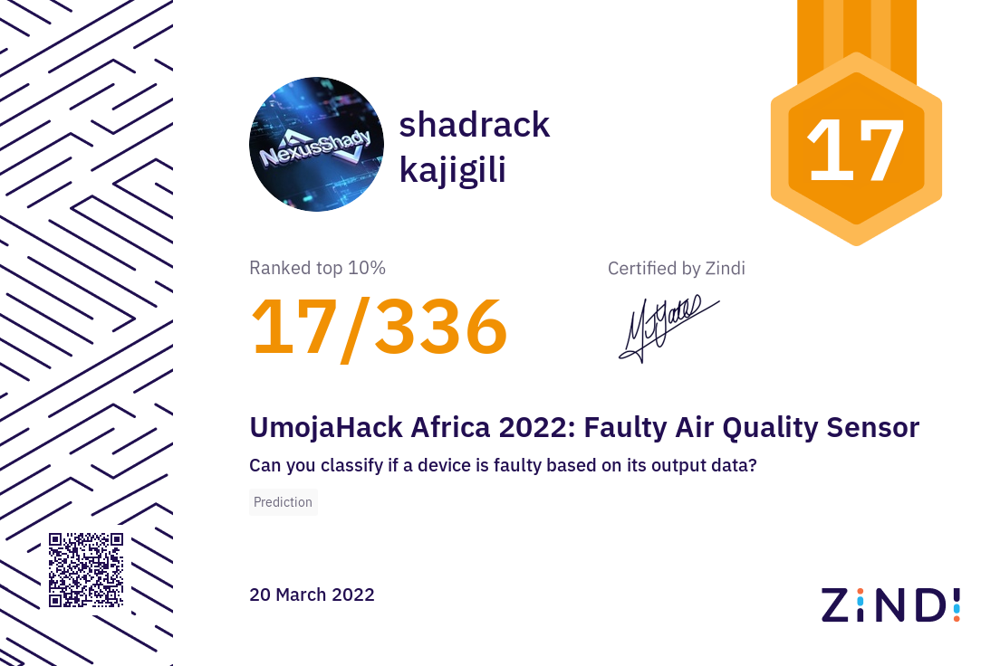

# 🏆 UmojaHack Africa 2022 — Beginner Track | Air Quality Fault Detection

> **Competition Result: 🥇 Ranked #17 out of all participants**

---

## 📜 Certificate of Achievement

<!-- Add your certificate image here -->
<!-- Replace the line below with your actual certificate image path -->
<!-- Example:  -->


---

## 📌 Competition Overview

**Event:** UmojaHack Africa 2022 — Beginner Track  
**Challenge:** Air Quality Sensor Fault Detection  
**Task:** Predict `Offset_fault` — a multiclass classification label indicating sensor faults in air quality monitoring devices  
**Platform:** Zindi  

Air quality sensors sometimes develop faults due to environmental conditions. The goal of this challenge was to build a machine learning model that could detect the type of offset fault (if any) in PM2.5 sensors based on readings from two sensors alongside temperature and relative humidity data.

---

## 📂 Repository Structure

```
├── Last_notebook.ipynb     # Main competition notebook
├── README.md               # This file
└── certificate.png         # Certificate of participation (add yours here)
```

---

## 🔍 Approach & Methodology

### 1. Exploratory Data Analysis (EDA)
- Visualized **missing values** across all columns using horizontal bar charts
- Identified significant **outliers** in `Sensor1_PM2.5` and `Sensor2_PM2.5` using box plots
- Analyzed **class imbalance** in the target variable `Offset_fault`

### 2. Data Preprocessing
- Filled missing values in `Sensor1_PM2.5` and `Sensor2_PM2.5` with a fixed value of `200` (empirically found to work best)
- Imputed missing values in `Temperature` and `Relative_Humidity` using the **median** (robust to outliers)
- Outliers were intentionally retained as they were deemed informative for fault detection

### 3. Feature Engineering
- **Sensor ratio:** `Sensor1_PM2.5 / Sensor2_PM2.5` — captures the relative difference between sensors
- **Humidity level:** Binned `Relative_Humidity` into `low`, `medium`, and `high` categories
- **Datetime features:** Extracted `month` and `hour` from the timestamp
- Applied `pd.get_dummies()` for one-hot encoding of categorical features

### 4. Model
- **Algorithm:** [CatBoostClassifier](https://catboost.ai/)
- **Key Hyperparameters:**
  - `learning_rate = 0.1`
  - `n_estimators = 1000`
  - `max_depth = 6`
  - `subsample = 0.8`
  - `l2_leaf_reg = 6`
  - `loss_function = 'MultiClass'`

### 5. Results
- **Validation Accuracy: ~95%** on the holdout set (30% split)

---

## 🛠️ Tech Stack

| Library | Purpose |
|---|---|
| `pandas` | Data manipulation |
| `numpy` | Numerical operations |
| `matplotlib` & `seaborn` | Data visualization |
| `scikit-learn` | Preprocessing, splitting, metrics |
| `catboost` | Main classification model |

---

## 🚀 How to Run

1. Clone this repository:
   ```bash
   git clone https://github.com/YOUR_USERNAME/YOUR_REPO_NAME.git
   cd YOUR_REPO_NAME
   ```

2. Install dependencies:
   ```bash
   pip install pandas numpy matplotlib seaborn scikit-learn catboost lightgbm
   ```

3. Add your dataset files to the appropriate path (or update the paths in the notebook):
   ```
   train.csv
   test.csv
   SampleSubmission.csv
   ```

4. Open and run the notebook:
   ```bash
   jupyter notebook Last_notebook.ipynb
   ```

---

## 👤 Author

**Your Name**  
Competing in UmojaHack Africa 2022 — Beginner Track  
📍 Tanzania

---

## 🌍 About UmojaHack Africa

[UmojaHack Africa](https://zindi.africa/competitions) is the largest student hackathon on the African continent, hosted on the Zindi platform. It brings together students from universities across Africa to solve real-world data science problems.

---

*Made with 💻 and ☕ during UmojaHack Africa 2022*